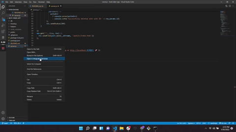

# Team profile generator

## License

## Description

An express.js application in which the user can add and save new notes as well as delete previously saved notes.

## Table of contents
* [Description](#description)
* [Usage](#usage)
* [Technologies](#technologies)
* [Preview](#preview)
* [Deployed](#deployed)

## Usage

Type the following command into your terminal to start the application:

npm start

## Technologies

* JavaScript

* Express.js

## Preview

## Deployed

[Note Taker App](https://github.com/kasai-codes/Note-taker-app)

